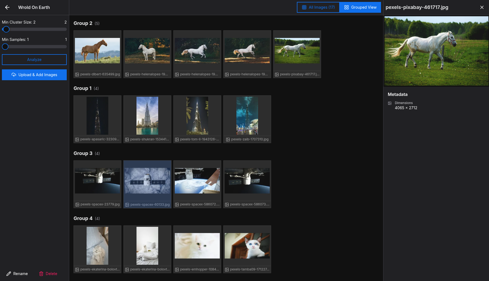
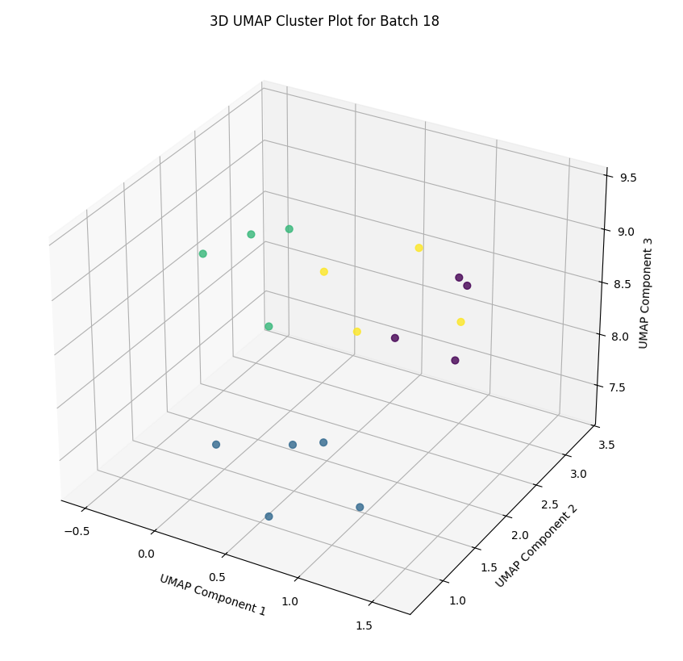

# Pixal Judge: Image Clustering & Analysis Tool

A full-stack application for uploading, managing, and visually clustering large image collections using machine learning.

## Demo with images of various types

  
  

## Core Features

* **Project Batches:** Group images into batches for analysis.
* **Image Upload:** Drag-and-drop uploads with file-hash duplicate detection.
* **ML Clustering:** Run analysis to find visual clusters with tunable parameters.
* **Metadata Inspection:** Automatically extracts and displays EXIF data (camera, GPS, shot time) for each image
* **Grouped View:** Toggle between viewing all images and viewing them grouped by their cluster
* **Async Processing:** Feature extraction and thumbnail generation run as background tasks.

## Tech Stack

* **Backend:** Python (FastAPI), PostgreSQL (SQLAlchemy), DINOv3 (feature extraction), HDBSCAN (clustering)
* **Frontend:** Next.js 15, TypeScript, HeroUI, TanStack Query
* **Utility:** Docker Compose, Alembic (migrations), OpenAPI (auto-generated client)
