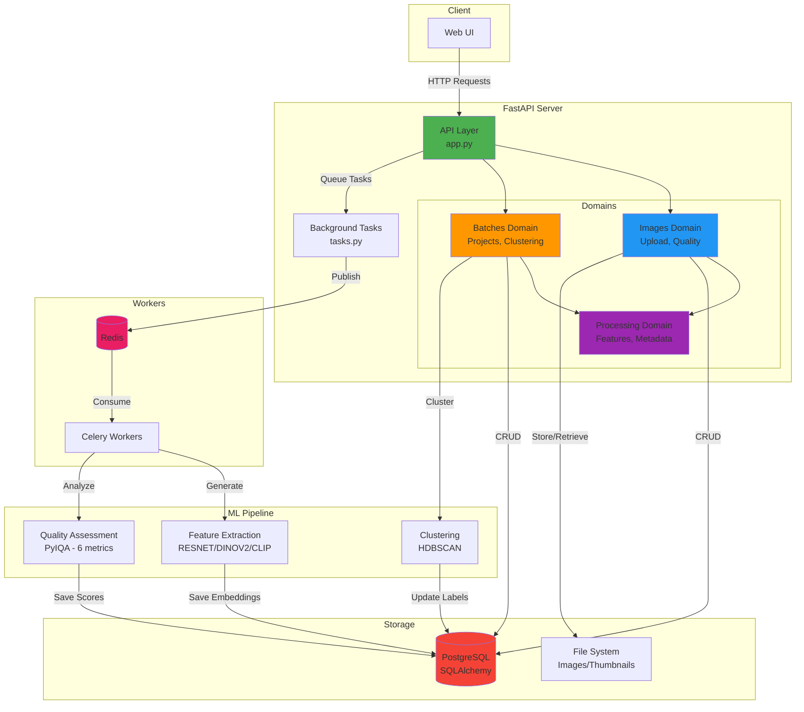
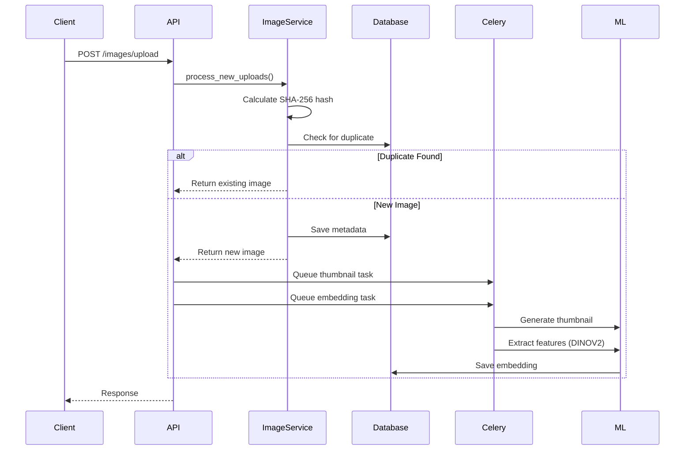
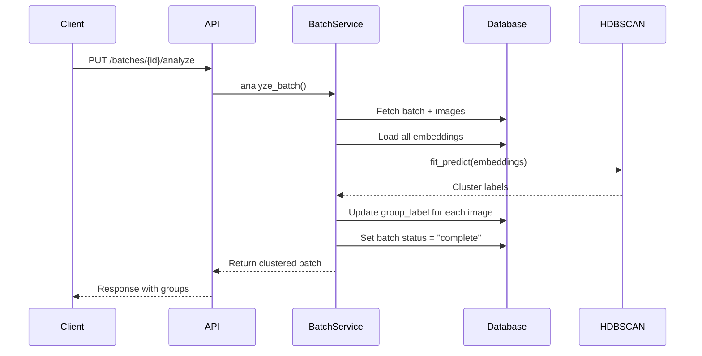
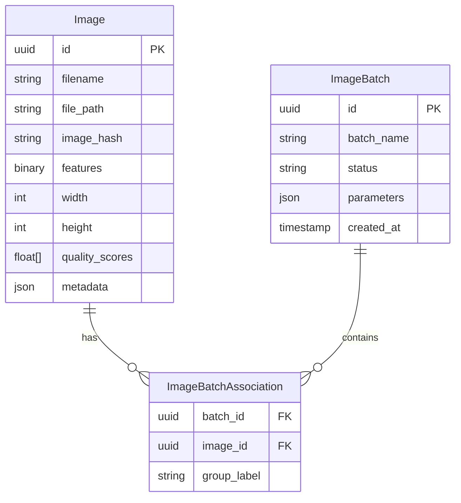

# PIXSORT - Backend Server

FastAPI backend for image processing and clustering with ML-powered feature extraction.

## 🏗️ Architecture



## 🚀 How It Works

### Image Upload Flow



### Clustering Analysis Flow



## 📁 Project Structure

```
server/
├── src/                    # Domain-based architecture
│   ├── images/            # Image domain (9 files)
│   ├── batches/           # Batch/clustering domain (8 files)
│   └── processing/        # Shared ML utilities (5 files)
├── alembic/               # Database migrations
├── utils/                 # File handling, exceptions
├── app.py                 # FastAPI application
├── database.py            # SQLAlchemy setup
├── tasks.py               # Celery background tasks
├── config.py              # Configuration management
└── startup.py             # Production entry point
```

## 🛠️ Tech Stack

- **Framework:** FastAPI
- **Database:** PostgreSQL + SQLAlchemy + Alembic
- **Task Queue:** Redis + Celery
- **ML Models:** PyTorch, RESNET50, DINOV2, CLIP
- **Clustering:** HDBSCAN
- **Quality:** PyIQA (BRISQUE, NIQE, PIQE, etc.)
- **Image Processing:** Pillow
- **Package Manager:** UV

## 🚦 Quick Start

```bash
# 1. Setup environment
cp example.env .env

# 2. Install dependencies
uv sync

# 3. Start database
docker-compose up -d db

# 4. Run migrations
alembic upgrade head

# 5. Start server (development)
python run_server.py

# 6. Start Celery worker (separate terminal)
celery -A tasks worker --loglevel=info
```

Server runs on: `http://localhost:8000`  
API Docs: `http://localhost:8000/docs`

## 📡 API Endpoints

### Images (`/images`)
- `POST /upload` - Upload images
- `GET /` - List all images
- `GET /{id}` - Get full image
- `GET /thumbnail/{id}` - Get thumbnail
- `GET /metadata/{id}` - Get EXIF metadata
- `DELETE /{id}` - Delete image

### Batches (`/batches`)
- `POST /` - Create batch
- `GET /` - List batches
- `GET /{id}` - Get batch details
- `PUT /{id}/analyze` - Run clustering
- `POST /{id}/images` - Add images to batch
- `PUT /{id}/groups` - Update group labels

## 🗄️ Database Schema



## 🐳 Docker Deployment

```bash
# Build and run all services
docker-compose up -d

# Services:
# - PostgreSQL: localhost:5432
# - Backend: localhost:8000
# - Frontend: localhost:3000
```
