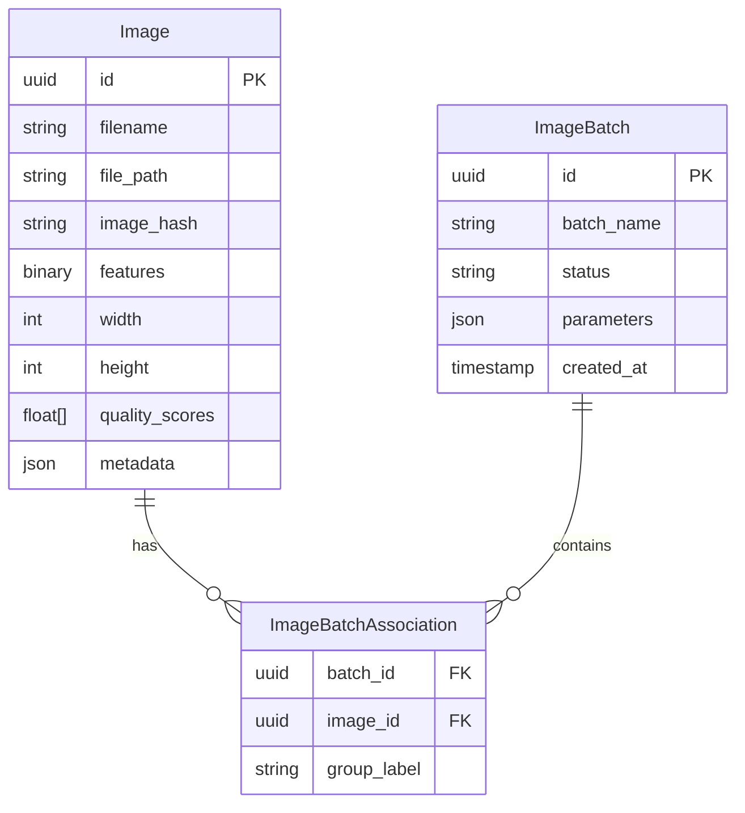

# PIXSORT - Backend Server

# PIXSORT - Server (Backend)

FastAPI backend for image processing and clustering with ML-powered feature extraction.

This is the backend for the PIXSORT application, a image processing and clustering API built with Python and FastAPI.

## 🏗️ Architecture

It handles all core logic, including file storage, database management, metadata extraction, machine learning feature embedding, and clustering analysis.

```mermaid

graph TB## Tech Stack

    subgraph Client

        UI[Web UI]  * **Framework:** **FastAPI** for REST APIs.

    end  * **Database:** **PostgreSQL** for relational data storage.

      * **ORM:** **SQLAlchemy** for database interaction and modeling.

    subgraph "FastAPI Server"  * **Migrations:** **Alembic** for database schema version control.

        API[API Layer<br/>app.py]  * **Data Validation:** **Pydantic** for API request/response schema validation.

          * **ML (Embeddings):** **PyTorch** with **Transformers** (specifically `DINOV3`) to generate vector embeddings from images.

        subgraph Domains  * **ML (Clustering):** **HDBSCAN** for density-based clustering of image features.

            IMG[Images Domain<br/>Upload, Quality]  * **Image Processing:** **Pillow** for thumbnail generation and metadata extraction.

            BAT[Batches Domain<br/>Projects, Clustering]  * **Async Tasks:** FastAPI's `BackgroundTasks` to offload heavy processing from the request-response cycle.

            PROC[Processing Domain<br/>Features, Metadata]

        end## Project Structure

        

        BG[Background Tasks<br/>tasks.py]```

    endserver/

    │

    subgraph Storage├── alembic/              # Database migration scripts

        DB[(PostgreSQL<br/>SQLAlchemy)]├── api/                  # FastAPI routers, schemas, and main app

        FS[File System<br/>Images/Thumbnails]│   ├── cluster_routes.py   # Endpoints for /batches

    end│   ├── image_routes.py     # Endpoints for /images

    │   ├── main.py             # Main FastAPI app setup and startup events

    subgraph Workers│   ├── schemas.py          # Pydantic models for API validation

        REDIS[(Redis)]│   └── tasks.py            # Background task definitions (embeddings, thumbnails)

        CELERY[Celery Workers]│

    end├── assets/               # (Created at runtime) Storage for images and thumbnails

    ├── crud/                 # CRUD operations (Create, Read, Update, Delete)

    subgraph "ML Pipeline"│   ├── crud_batch.py       # Database logic for batches

        FEAT[Feature Extraction<br/>RESNET/DINOV2/CLIP]│   └── crud_image.py       # Database logic for images

        QUAL[Quality Assessment<br/>PyIQA - 6 metrics]│

        CLUST[Clustering<br/>HDBSCAN]├── database/             # Database connection and ORM models

    end│   ├── database.py         # SQLAlchemy engine and session setup

    │   └── models.py           # SQLAlchemy table models (Image, ImageBatch)

    UI -->|HTTP Requests| API│

    API --> IMG├── processing/           # Core ML and image processing logic

    API --> BAT│   ├── feature_extraction.py # DINOV3/ResNet models for embeddings

    IMG --> PROC│   ├── grouping.py         # HDBSCAN clustering logic

    BAT --> PROC│   └── metadata_extraction.py # EXIF metadata extraction

    │

    API -->|Queue Tasks| BG├── services/             # Business logic layer

    BG -->|Publish| REDIS│   ├── batch_service.py    # Orchestrates clustering and batch management

    REDIS -->|Consume| CELERY│   ├── image_service.py    # Handles image uploads, duplicates, and deletion

    │   └── startup_service.py  # Checks for missing data on app start

    IMG -->|CRUD| DB│

    BAT -->|CRUD| DB├── utils/                # Utility functions

    IMG -->|Store/Retrieve| FS│   └── file_handling.py    # Saving files, creating thumbnails

    │

    CELERY -->|Generate| FEAT├── .env                  # (Not tracked) Local environment variables

    CELERY -->|Analyze| QUAL├── .gitignore

    BAT -->|Cluster| CLUST├── alembic.ini           # Alembic configuration

    ├── config.py             # Application configuration (loads .env)

    FEAT -->|Save Embeddings| DB├── docker-compose.yml    # Docker config for PostgreSQL database

    QUAL -->|Save Scores| DB├── example.env           # Template for environment variables

    CLUST -->|Update Labels| DB├── init.sql              # Database schema initialization

    ├── requirements.txt      # Python dependencies

    style API fill:#4CAF50└── run_server.py         # Entry point to run the server

    style IMG fill:#2196F3```

    style BAT fill:#FF9800

    style PROC fill:#9C27B0## How It Works

    style DB fill:#F44336

    style REDIS fill:#E91E63### 1\. Application Startup

```

  * The FastAPI app is initialized.

## 🚀 How It Works  * Asset directories (`/assets/images`, `/assets/thumbnails`) are created if they don't exist.

  * Two background threads are started:

### Image Upload Flow      * One to find all images missing embeddings and queue `generate_embedding_task` for them.

```mermaid      * One to find all images missing thumbnails and queue `generate_thumbnail_task` for them.

sequenceDiagram

    participant Client### 2\. Image Upload Flow

    participant API

    participant ImageService1.  A request hits `POST /images/upload` with one or more files.

    participant Database2.  `image_service.process_new_uploads` is called:

    participant Celery      * A SHA-256 hash is calculated for the file.

    participant ML      * The database is checked for an existing image with the same hash.

      * If it's a duplicate, a response is returned noting the duplication.

    Client->>API: POST /images/upload      * If it's new, the file is saved to disk with a unique UUID filename.

    API->>ImageService: process_new_uploads()      * Basic EXIF metadata (width, height, shot time, etc.) is extracted.

    ImageService->>ImageService: Calculate SHA-256 hash      * A new `Image` record is created in the database with the file info and metadata.

    ImageService->>Database: Check for duplicate3.  Back in the API route, `BackgroundTasks` are queued for each *new* image:

    alt Duplicate Found      * `generate_thumbnail_task`: Creates a thumbnail.

        ImageService-->>API: Return existing image      * `generate_embedding_task`: Uses the `DINOV3` model to generate a feature vector and save it to the `features` column of the image.

    else New Image

        ImageService->>Database: Save metadata### 3\. Clustering Analysis Flow

        ImageService-->>API: Return new image

        API->>Celery: Queue thumbnail task1.  A request hits `PUT /batches/{batch_id}/analyze` with clustering parameters (e.g., `min_cluster_size`).

        API->>Celery: Queue embedding task2.  `batch_service.analyze_batch` is called:

        Celery->>ML: Generate thumbnail      * It fetches the batch and all its associated images.

        Celery->>ML: Extract features (DINOV2)      * It fails if any image is missing its feature embeddings.

        ML->>Database: Save embedding      * It collects all image features into a single NumPy matrix.

    end      * An `ImageGrouper` instance is created with the user-provided parameters.

    API-->>Client: Response      * `hdbscan.fit_predict` is called on the feature matrix.

```      * The resulting labels (e.g., `-1`, `0`, `1`, `2`) are mapped to human-readable names ("Ungrouped", "Group 1", "Group 2", etc.).

      * The `group_label` for each image in the `ImageBatchAssociation` table is updated with the result.

### Clustering Analysis Flow      * The batch `status` is set to "complete" and the updated batch is returned.

```mermaid

sequenceDiagram## Database

    participant Client

    participant APIThe application uses a **PostgreSQL** database with a custom schema named `image_clustering`. The schema is managed by **Alembic**.

    participant BatchService

    participant Database### Key Models

    participant HDBSCAN

  * **`Image`**: Stores all data for a single uploaded image.

    Client->>API: PUT /batches/{id}/analyze      * `id`, `filename`, `original_filename`, `file_path`, `image_hash`

    API->>BatchService: analyze_batch()      * `features` (LargeBinary): The stored vector embedding.

    BatchService->>Database: Fetch batch + images      * Metadata fields: `width`, `height`, `shot_at`, `camera_make`, `iso`, etc.

    BatchService->>Database: Load all embeddings  * **`ImageBatch`**: Represents a "project" or collection of images.

    BatchService->>HDBSCAN: fit_predict(embeddings)      * `id`, `batch_name`, `status`, `parameters` (JSON for cluster settings).

    HDBSCAN-->>BatchService: Cluster labels  * **`ImageBatchAssociation`**: A many-to-many link table connecting `Image` and `ImageBatch`.

    BatchService->>Database: Update group_label for each image      * `batch_id` (PK, FK)

    BatchService->>Database: Set batch status = "complete"      * `image_id` (PK, FK)

    BatchService-->>API: Return clustered batch      * `group_label` (String): Stores the result of the clustering (e.g., "Group 1").

    API-->>Client: Response with groups

```## API Endpoints


## 📁 Project Structure### Image Routes (`/images`)


```  * `POST /upload`: Uploads one or more images.

server/  * `GET /`: Get a list of all images in the database.

├── src/                    # Domain-based architecture  * `GET /{image_id}`: Serves the full-resolution image file.

│   ├── images/            # Image domain (9 files)  * `GET /thumbnail/{image_id}`: Serves the image thumbnail.

│   ├── batches/           # Batch/clustering domain (8 files)  * `GET /metadata/{image_id}`: Returns a JSON object of the image's stored metadata.

│   └── processing/        # Shared ML utilities (5 files)  * `DELETE /{image_id}`: Deletes an image from the database and its files from disk.

├── alembic/               # Database migrations

├── utils/                 # File handling, exceptions### Batch Routes (`/batches`)

├── app.py                 # FastAPI application

├── database.py            # SQLAlchemy setup  * `POST /`: Creates a new batch with a name and a list of image IDs.

├── tasks.py               # Celery background tasks  * `GET /`: Get a list of all batches.

├── config.py              # Configuration management  * `GET /{batch_id}`: Get detailed information for a single batch, including all its images and their group labels.

└── startup.py             # Production entry point  * `PUT /{batch_id}`: Renames a batch.

```  * `DELETE /{batch_id}`: Deletes a batch and its associations (but not the images themselves).

  * `POST /{batch_id}/images`: Adds existing images (by ID) to a batch.

## 🛠️ Tech Stack  * `DELETE /{batch_id}/images`: Removes images (by ID) from a batch.

  * `POST /{batch_id}/upload-and-add`: A convenience endpoint that uploads new images and adds them to the specified batch in one call.

- **Framework:** FastAPI  * `PUT /{batch_id}/analyze`: Runs the clustering analysis on the batch.

- **Database:** PostgreSQL + SQLAlchemy + Alembic  * `PUT /{batch_id}/groups`: Manually updates the group labels for images in a batch (e.g., from the UI).

- **Task Queue:** Redis + Celery

- **ML Models:** PyTorch, RESNET50, DINOV2, CLIP## Setup and Running

- **Clustering:** HDBSCAN

- **Quality:** PyIQA (BRISQUE, NIQE, PIQE, etc.)1.  **Start the Database:**

- **Image Processing:** Pillow

- **Package Manager:** UV      * Create a `.env` file from `example.env` and fill in your database credentials (username, password, db name).

      * Run `docker-compose up -d` to start the PostgreSQL container. This will also automatically run `init.sql` to create the `image_clustering` schema.

## 🚦 Quick Start

2.  **Create Python Environment:**

```bash

# 1. Setup environment      * Create a virtual environment: `python -m venv .venv`

cp example.env .env      * Activate it: `source .venv/bin/activate` (or `.\.venv\Scripts\activate` on Windows)

      * Install dependencies: `pip install -r requirements.txt`.

# 2. Install dependencies

uv sync3.  **Run Database Migrations:**


# 3. Start database      * Apply all database migrations to create the tables: `alembic upgrade head`

docker-compose up -d db

4.  **Run the Server:**

# 4. Run migrations

alembic upgrade head      * Execute the run script: `python run_server.py`.

      * The server will be running on `http://0.0.0.0:8000`.
# 5. Start server (development)
python run_server.py

# 6. Start Celery worker (separate terminal)
celery -A tasks worker --loglevel=info
```

Server runs on: `http://localhost:8000`  
API Docs: `http://localhost:8000/docs`

## 📡 API Endpoints

### Images (`/images`)
- `POST /upload` - Upload images
- `GET /` - List all images
- `GET /{id}` - Get full image
- `GET /thumbnail/{id}` - Get thumbnail
- `GET /metadata/{id}` - Get EXIF metadata
- `DELETE /{id}` - Delete image

### Batches (`/batches`)
- `POST /` - Create batch
- `GET /` - List batches
- `GET /{id}` - Get batch details
- `PUT /{id}/analyze` - Run clustering
- `POST /{id}/images` - Add images to batch
- `PUT /{id}/groups` - Update group labels

## 🗄️ Database Schema



## 🐳 Docker Deployment

```bash
# Build and run all services
docker-compose up -d

# Services:
# - PostgreSQL: localhost:5432
# - Backend: localhost:8000
# - Frontend: localhost:3000
```
